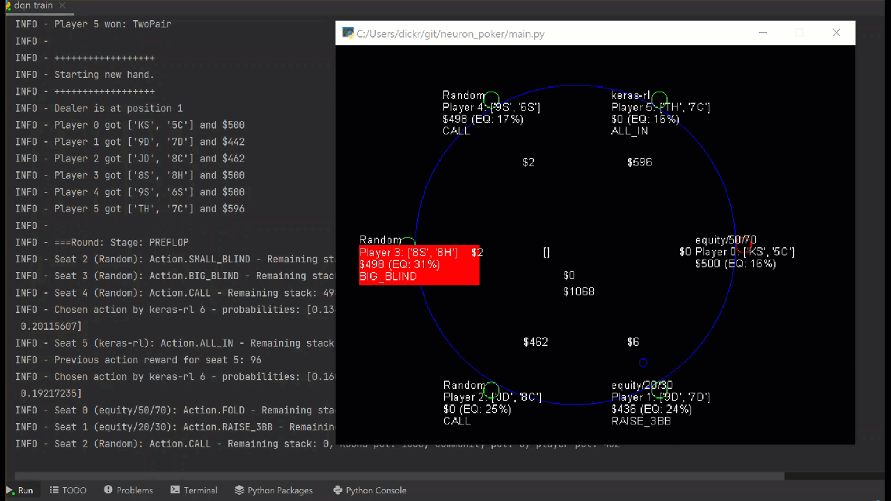
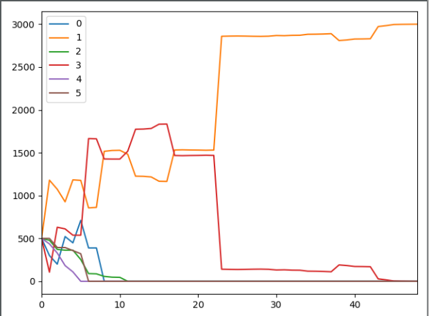
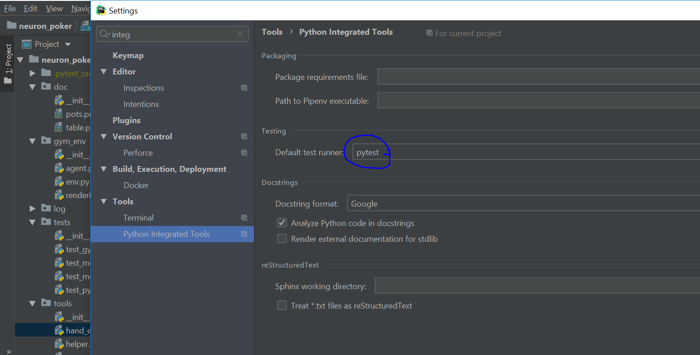
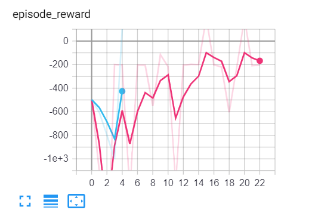

Neuron Poker: OpenAi gym environment for texas holdem poker
===========================================================

This is an environment for training neural networks to play texas
holdem. Please try to model your own players and create a pull request
so we can collaborate and create the best possible player.

Usage:
------

Run:

- Install Anaconda, I would also recommend to install pycharm.
- Create a virtual environment with ``conda create -n neuron_poker python=3.7``
- Activate it with ``conda activate neuron_poker``, then install all required packages with ``pip install -r requirements.txt``
- Run 6 random players playing against each other:
  ``main.py selfplay random --render`` or
- To manually control the players:``main.py selfplay keypress --render``
- Example of genetic algorighm with self improvement: ``main.py selfplay equity_improvement --improvement_rounds=20 --episodes=10``
- In order to use the c++ version of the equity calculator, you will also need to install visual studio 2019 (or gcc over cygwin may work as well). To use it, use the -c option when running main.py.
- For more advanced users: ``main.py selfplay dqn_train -c`` will start training the deep Q agent with c++ montecarlo for faster calculation

Analysis of the run
~~~~~~~~~~~~~~~~~~~

At the end of an episode, the performance of the players can be observed via the summary plot.
|image0|

Packages and modules:
~~~~~~~~~~~~~~~~~~~~~

main.py: entry point and command line interpreter. Runs agents with the gym. The docstring at the top of the file describes the command line options.
They are interpreted by docopt.

gym\_env
~~~~~~~~

-  ``env.py``: Texas Hold’em unlimited openai gym environment &
   ``rendering.py``: rendering graphics while playing

agents
~~~~~~
Please add your model based agents here.

-  ``agent_random.py``: an agent making random decisions
-  ``agent_keypress.py``: an agent taking decision via keypress
-  ``agent_consider_equity.py``: an agent considering equity information
-  ``agent_keras_rl_dqn.py``: Deep Q learning agent, using keras-rl for deep reinforcement learning
-  ``agent_custom_q1.py``: Custom implementation of deep q learning

Note that the observation property is a dictionary that contains all the information about the players and table that can be used to make a decision.

Custom implementation of q learning
~~~~~~~~~~~~~~~~~~~~~~~~~~~~~~~~~~~
Custom impelemtation of reinforcement learning. This package is now in a separate repo:
www.github.com/dickreuter/tf_rl

tools
~~~~~

-  ``hand_evaluator.py``: evaluate the best hand of multiple players
-  ``helper.py``: helper functions
-  ``montecarlo_numpy2.py``: fast numpy based montecarlo simulation to
   calculate equity. Not yet working correctly. Some tests are failing. Feel free to fix them.
-  ``montecarlo_python.py``: relatively slow python based montecarlo for equity calculation. Supports
   preflight ranges for other players.
-  ``montecarlo_cpp``: c++ implementation of equity calculator. Around 500x faster than python version

tests
^^^^^

-  ``test_gym_env.py``: tests for the end.
-  ``test_montecarlo.py``: tests for the hands evaluator and python
   based equity calculator.
-  ``test_montecarlo_numpy.py``: tests for the numpy montecarlo
-  ``test_pylint.py``: pylint and pydoc tests to ensure pep8 standards and static code analysis

Roadmap
-------

Agents
~~~~~~

- [x] Agent based on user interaction (keypress)
- [x] Random agent
- [x] Equity based strategy (i.e. call and bet above threshold)
- [x] Equity based strategy with genetic algorithm, adjusting the treshold based on winning agent.
- [x] C++ imlementation of equity calculator to significantly speed up runs
- [x] Agent based on reinforcement learning with experience replay (Deep Q learning, based on keras-rl)
- [/] Custom agents (see above section for more details)

Reinforcement learning: Deep Q agent
~~~~~~~~~~~~~~~~~~~~~~~~~~~~~~~~~~~~

``neuron_poker.agents.agent_dqn`` implements a deep q agent with help of keras-rl.
A number of parameters can be se:

- nb_max_start_steps = 20  # maximum of random actions at the beginning
- nb_steps_warmup = 75  # before training starts, should be higher than start steps
- nb_steps = 10000  # total number of steps
- memory_limit = int(nb_steps / 3)  # limiting the memory of experience replay
- batch_size = 500  # number of items sampled from memory to train

Training can be observed via tensorboard (run ``tensorboard --logdir=./Graph`` from command line)
|image2|

How to contribute
-----------------

Launching from main.py
~~~~~~~~~~~~~~~~~~~~~~

In ``main.py`` an agent is launched as follows (here adding 6 random
agents to the table). To edit what is accepted to main.py via command
line, simply add another line in the docstring at the top of main.py.

.. code:: python

    def random_action(render):
        """Create an environment with 6 random players"""
        env_name = 'neuron_poker-v0'
        stack = 500
        self.env = gym.make(env_name, num_of_players=6, initial_stacks=stack)
        for _ in range(num_of_plrs):
            player = RandomPlayer(500)
            self.env.add_player(player)

        self.env.reset()

As you can see, as a first step, the environment needs to be created. As a second step, different agents need to be
added to the table. As a third step the game is kicked off with a reset. Agents with autoplay set to True will automatically
play, by having the action method called of their class. Alternatively you can use the PlayerShell class
and the environment will require you call call the step function manually and loop over it. This may be helpful
when using other packages which are designed to interface with the gym, such as keras-rl.

Adding a new model / agent
^^^^^^^^^^^^^^^^^^^^^^^^^^

An example agent can be seen in random\_agent.py

To build a new agent, an agent needs to be created, where the follwing
function is modified. You will need to use the observation parameter,
which contains the current state of the table, the players and and the
agent itself, as a parameter to determine the best action.

.. code:: python

    def action(self, action_space, observation):  # pylint: disable=no-self-use
        """Mandatory method that calculates the move based on the observation array and the action space."""
        _ = observation  # not using the observation for random decision
        this_player_action_space = {Action.FOLD, Action.CHECK, Action.CALL, Action.RAISE_POT, Action.RAISE_HAlF_POT}
        possible_moves = this_player_action_space.intersection(set(action_space))
        action = random.choice(list(possible_moves))
        return action

Observing the state
~~~~~~~~~~~~~~~~~~~

The state is represented as a numpy array that contains the following
information:

.. code:: python

    class CommunityData:
        def __init__(self, num_players):
            self.current_player_position = [False] * num_players  # ix[0] = dealer
            self.stage = [False] * 4  # one hot: preflop, flop, turn, river
            self.community_pot: float: the full pot of this hand
            self.current_round_pot: float: the pot of funds added in this round
            self.active_players = [False] * num_players  # one hot encoded, 0 = dealer
            self.big_blind
            self.small_blind

    class StageData:  # as a list, 8 times:
        """Preflop, flop, turn and river, 2 rounds each"""

        def __init__(self, num_players):
            self.calls = [False] * num_players  # ix[0] = dealer
            self.raises = [False] * num_players  # ix[0] = dealer
            self.min_call_at_action = [0] * num_players  # ix[0] = dealer
            self.contribution = [0] * num_players  # ix[0] = dealer
            self.stack_at_action = [0] * num_players  # ix[0] = dealer
            self.community_pot_at_action = [0] * num_players  # ix[0] = dealer

    class PlayerData:
        "Player specific information"

        def __init__(self):
            self.position: one hot encoded, 0=dealer
            self.equity_to_river: montecarlo
            self.equity_to_river_2plr: montecarlo
            self.equity_to_river_3plr: montecarlo
            self.stack: current player stack

How to integrate your code on Github
~~~~~~~~~~~~~~~~~~~~~~~~~~~~~~~~~~~~

It will be hard for one person alone to beat the world at poker. That's
why this repo aims to have a collaborative environment, where models can
be added and evaluated.

To contribute do the following:

- Get Pycharm and build the virtual python environment. Use can do: ``pip install -r requirements.txt``
- If you want to use the 500x faster c++ based equity calculator, also install visual studio, but this is not necessary
- Clone your fork to your local machine. You can do this directly from pycharm: VCS --> check out from version control --> git
- Add as remote the original repository where you created the fork from and call it upstream (the connection to your fork should be called origin). This can be done with vcs --> git --> remotes
- Create a new branch: click on master at the bottom right, and then click on 'new branch'
- Make your edits.
- Ensure all tests pass. Under file --> settings --> python integrated tools switch to pytest (see screenshot). |image1| You can then just right click on the tests folder and run all tests. All tests need to pass. Make sure to add your own tests by simply naming the funtion test\_... \
- Make sure all the tests are passing. Best run pytest as described above (in pycharm just right click on the tests folder and run it). If a test fails, you can debug the test, by right clicking on it and put breakpoints, or even open a console at the breakpoint: https://stackoverflow.com/questions/19329601/interactive-shell-debugging-with-pycharm
- Commit your changes (CTRL+K}
- Push your changes to your origin (your fork) (CTRL+SHIFT+K)
- To bring your branch up to date with upstream master, if it has moved on: rebase onto upstream master: click on your branch name at the bottom right of pycharm, then click on upstream/master, then rebase onto. You may need to resolve soe conflicts. Once this is done, make sure to always force-push (ctrl+shift+k), (not just push). This can be done by selecting the dropdown next to push and choose force-push (important: don't push and merge a rebased branch with your remote)
- Create a pull request on your github.com to merge your branch with the upstream master.
- When your pull request is approved, it will be merged into the upstream/master.

